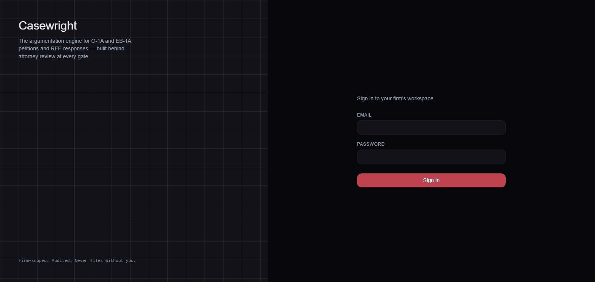

# Casewright - Ai Agent helping Immigration Lawyers

**An attorney-reviewed argumentation  Agent built with deep harness engine for O-1A / EB-1A immigration petitions and RFE
responses.**

Casewright takes a beneficiary's case file — CV, awards, recommendation letters, prior filings —
and produces a criterion-by-criterion assessment, a filing strategy, and cited, verified draft
sections, with a licensed attorney required to approve every consequential step. Nothing files
itself; every gate is a human decision, every citation is checked against the actual evidence
before it ships.

[](backend/requirements.txt)
[](backend/requirements.txt)
[](frontend/package.json)
[](frontend/package.json)
[](docker-compose.yml)
[](backend/requirements.txt)
[](docker-compose.yml)

**Live**: [casewright-two.vercel.app](https://casewright-two.vercel.app) · [Deployment guide](docs/deployment.md)

**Try it** — sign in with the demo firm (synthetic data only, no real client information):
- Email: `verify@casewright.app`
- Password: `VerifyDeploy123!`



## What it does

- **Petition analysis** — assesses a case against all O-1A (8) or EB-1A (10) regulatory
  criteria in parallel, each with a confidence score and specific evidence gaps.
- **Filing strategy** — recommends which criteria to argue and which to abandon, with a
  narrative and RFE-risk flags, gated on attorney approval before drafting starts.
- **Drafting** — generates cited draft sections (exhibits and legal authorities), verified for
  citation integrity and factual consistency against the case file before an attorney ever sees
  them.
- **RFE response** — parses an incoming Request for Evidence, plans a per-objection rebuttal,
  and drafts the response under the same verification + gate discipline.
- **Case management shell** — a full CRM-style UI: dashboard with live case health scores and
  deadline tracking, a firm-wide document library, a client roll-up, a deadline calendar, grounded
  Q&A over a case's extracted facts, and an audit-log-backed activity feed.
- **Everything is attorney-gated and audited** — no draft reaches "ready to file" without an
  explicit approval, and every consequential action is written to an append-only audit log.

See [`docs/architecture.md`](docs/architecture.md) for the system design, data model, and the two
LangGraph agent graphs (with diagrams). See [`docs/internal/`](docs/internal/) for the full build
history and the task-by-task plan this project was built against.

## Quickstart

```bash
cp .env.example .env
docker compose up -d --build
docker compose exec backend python -m scripts.create_firm \
  --name "Your Firm" --email admin@yourfirm.test --password change-me
```

- App: <http://localhost:8080>
- API: <http://localhost:8080/api> (backend also directly on `:8000`)
- MinIO console: <http://localhost:9001>

By default the app runs without a configured LLM key — everything except the actual agent runs
(document upload, case management, the full CRM shell) works immediately. Set `OLLAMA_API_KEY`
(or point `backend/app/agents/llm.py` at another OpenAI-compatible provider) in `.env` to enable
petition/RFE runs.

## Development

**Backend**

```bash
cd backend
python -m venv .venv && .venv/Scripts/activate   # or `source .venv/bin/activate` on macOS/Linux
pip install -r requirements-dev.txt

# Point DATABASE_URL / DATABASE_URL_SYNC at a running Postgres, e.g.:
docker compose up -d db   # publishes on host port 5433

alembic upgrade head
ruff check .
mypy app
pytest
```

Tests run against a real Postgres (a `casewright_test` database, created automatically) — the
schema uses Postgres-only types (JSONB, pgvector) that sqlite can't represent, and the cross-firm
tenancy isolation test is the one that actually matters.

**Frontend**

```bash
cd frontend
npm install
npm run dev      # Vite dev server
npm run build    # production build (tsc -b && vite build)
npm test         # Vitest + React Testing Library
```

## Operations

```bash
ops/backup_db.sh                       # pg_dump the live db into ./backups/ (gitignored)
ops/restore_rehearsal.sh <dump-file>   # restore into a scratch db, verify row counts, clean up

python -m scripts.eval_golden_cases --fixtures-dir eval_fixtures   # golden-case eval harness
python -m scripts.ingest_precedent --firm-id <uuid> --file f.txt --ref "..."  # firm precedent
python -m scripts.report_metrics                                    # verification blocker rate, gate wait time
```

Structured JSON logs (`structlog`) are on by default; set `SENTRY_DSN` to enable error tracking.

## Deployment

Local development runs entirely on Docker Compose (Postgres + MinIO + backend + frontend +
nginx). For a hosted deployment (Supabase for Postgres + storage, Render for the backend, Vercel
for the frontend), see [`docs/deployment.md`](docs/deployment.md).

## Project structure

```
casewright/
├── backend/       FastAPI + SQLAlchemy async + LangGraph agent layer
├── frontend/      React + Vite + TypeScript + Tailwind
├── nginx/         Reverse proxy config (single origin for the browser)
├── ops/           Backup/restore rehearsal scripts
└── docs/
    ├── architecture.md   System design, data model, agent graphs
    ├── internal/         Build diary, task ledger, source planning docs
    └── reference/         Third-party design reference (not shipped product code)
```

Full breakdown in [`docs/architecture.md`](docs/architecture.md#directory-structure).
