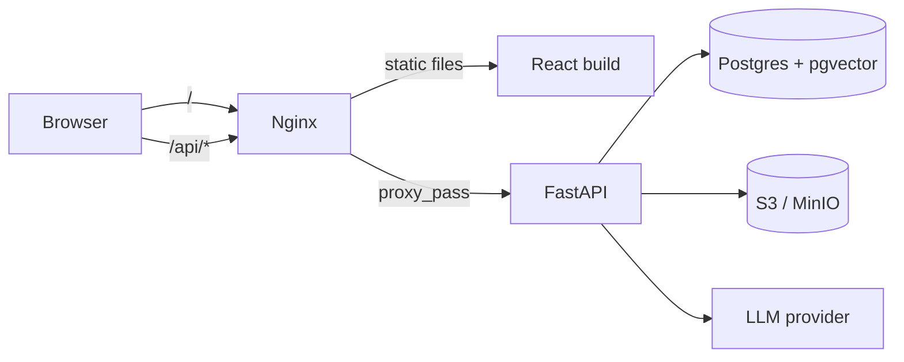
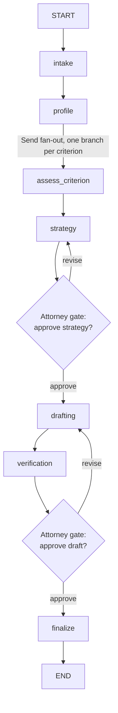
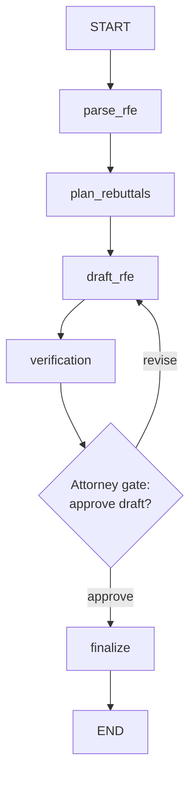

# Architecture

Casewright is a multi-tenant SaaS for immigration law boutiques: it takes a beneficiary's case
file (CV, awards, letters, prior filings) and produces attorney-reviewed petition strategy and
RFE (Request for Evidence) rebuttal drafts, grounded in a seeded corpus of USCIS criterion
standards and citable authorities.

## Tech stack

| Layer | Choice | Why |
|---|---|---|
| API | FastAPI + Pydantic v2, async throughout | Native async fits an I/O-bound app (DB + LLM calls); Pydantic gives request/response validation for free. |
| Database | PostgreSQL 16 + pgvector | JSONB for flexible per-node agent state, pgvector for the knowledge-corpus retrieval, one engine instead of a separate vector store. |
| ORM | SQLAlchemy 2.0 (async) + Alembic | Typed models, async session, real migrations — no ORM magic hiding the schema. |
| Agent layer | LangGraph 1.x + `AsyncPostgresSaver` | Explicit state machines with durable checkpointing — an agent run can pause at a human-review gate and resume days later without losing state. |
| Object storage | S3-compatible (MinIO locally) | Uploaded documents and generated drafts; swappable for any S3-compatible provider (Supabase Storage, AWS S3, R2) without code changes. |
| LLM | OpenAI-compatible client (`openai` SDK) against Ollama Cloud | The app never imports a vendor SDK directly outside `app/agents/llm.py` — switching providers is a one-file change (see `docs/internal/PROJECT_LOG.md`'s provider-swap entry). |
| Frontend | React 18 + Vite + TypeScript + Tailwind | Fast dev loop, typed API contracts shared via `types.ts`, no meta-framework overhead for what is fundamentally a dashboard + review UI. |
| State/data | TanStack Query | Server-state cache with shared query keys across components (e.g. the sidebar badge, command palette, and case list all read the same `["cases"]` cache) — no separate client-state store needed. |
| UI primitives | Radix UI (unstyled) + custom token-driven CSS | Accessible interaction primitives (dialogs, popovers, tabs) with 100% of the visual language coming from `frontend/src/theme/tokens.css`, not a component library's opinions. |
| Reverse proxy | Nginx | Single origin for the browser (`/` → static frontend, `/api` → backend) — no CORS dance in production. |
| Orchestration (dev) | Docker Compose | `db` + `minio` + `backend` + `frontend` + `nginx`, one command to a running stack. |

## Request flow



## Multi-tenancy

Every tenant-owned table carries a `firm_id`. There is exactly one sanctioned way a route
touches a `Case`: `app/api/deps.py::get_case_scoped`, which filters by the caller's `firm_id`
and returns **404** (not 403) on a cross-tenant id — this avoids leaking whether a resource
exists at all to a firm that doesn't own it. No route queries `Case` (or any tenant table)
directly; this is enforced by convention and tested directly (`tests/test_active_runs.py`,
`tests/test_rollups.py`, etc. all assert cross-firm isolation as a first-class test case, not an
afterthought).

The audit log (`audit_log` table) is append-only, enforced by a Postgres `BEFORE UPDATE OR
DELETE` trigger rather than a table-level `GRANT` — a trigger binds every role including the
table owner, which a `REVOKE` alone does not.

## Data model

Sixteen tables, grouped by concern:

- **Tenancy**: `firms`, `users`
- **Case file**: `cases`, `documents`, `extracted_facts`
- **Petition reasoning**: `criterion_assessments`, `strategy_memos`
- **Drafting**: `drafts`, `draft_sections`, `citations`
- **RFE**: `rfe_notices`, `rfe_objections`
- **Agent runs**: `agent_runs` (status, current gate, and a `progress` JSONB column driving the
  frontend's live pipeline tracker)
- **Ops**: `audit_log`, `billing_events`
- **Knowledge**: `knowledge_chunks` (pgvector-embedded criterion standards, authorities, and
  argument patterns, retrieved during `assess_criterion`/drafting)

See `backend/app/models/__init__.py` for the canonical list and `backend/alembic/versions/` for
the migration history.

## Agent layer (LangGraph)

Two graphs, both built the same way: an explicit node sequence, one or more **human-review
gates** implemented as `interrupt()` calls that pause the graph and checkpoint its state to
Postgres, and a verification step before anything reaches a gate.

### Petition graph



`assess_criterion` runs once per O-1A/EB-1A criterion (8 or 10, depending on category) via
LangGraph's `Send` API — a real parallel fan-out, not a loop, so all criteria are assessed
concurrently and the graph only proceeds to `strategy` once every branch has joined.

### RFE graph



Both graphs' revision loops are **bounded** (a max-rounds guard), so a stuck disagreement between
the model and the verification layer can't loop forever.

### Verification, not vibes

Before a draft ever reaches an attorney gate, `verify_section` checks every citation marker
(`[EX-3]`, `[8 CFR 204.5(h)(3)(i)]`) resolves to a real exhibit or seeded authority, and — when an
LLM is configured — runs a fact-consistency pass against the extracted case facts. Anything
unresolved is held at `needs_attention` with the specific blocker recorded, never silently
shipped. This has caught real issues in live-model runs, not just synthetic test fixtures — see
the "nothing uncited ships" entries in `docs/internal/PROJECT_LOG.md`.

### Why nodes never call the LLM SDK directly

Every node calls `app/agents/llm.py::call_structured(...)` — a tool-forced structured-output
wrapper with a bounded self-repair retry — instead of importing an LLM SDK. This is what made a
mid-project provider swap (Anthropic → an OpenAI-compatible endpoint) a one-file change instead
of a rewrite.

## Directory structure

```
casewright/
├── backend/
│   ├── app/
│   │   ├── agents/        # LangGraph state machines + the LLM router
│   │   ├── api/            # FastAPI routers — one module per resource, all firm-scoped
│   │   ├── eval/            # Golden-case evaluation harness (scoring is pure, replay hits the DB)
│   │   ├── models/         # SQLAlchemy ORM models
│   │   ├── schemas/        # Pydantic request/response models
│   │   ├── services/        # Storage, audit log, health/risk scoring, LLM router, logging
│   │   ├── config.py, db.py, main.py
│   ├── alembic/             # Migrations
│   ├── scripts/             # Onboarding, seeding, ingestion, metrics — run inside the container
│   └── tests/                # pytest against a real Postgres, not sqlite
├── frontend/
│   └── src/
│       ├── pages/            # Route-level screens
│       ├── components/       # Reusable UI, grouped by feature (pipeline/, shell/, ui/)
│       ├── lib/                # apiFetch, status/tone helpers, shared derivations
│       └── theme/            # The entire visual language lives in tokens.css
├── nginx/                    # Reverse proxy config
├── ops/                       # Backup/restore rehearsal scripts
└── docs/
    ├── architecture.md        # this file
    ├── internal/               # build history, task ledger, source planning docs
    └── reference/              # third-party design reference (not shipped product code)
```

## Testing strategy

- Backend: `pytest` against a **real** Postgres (JSONB + pgvector aren't representable in
  sqlite), with the cross-firm tenancy test treated as non-negotiable in every phase, not just
  Phase 0. LLM calls are mocked in the unit/integration suite; the agent graphs have additionally
  been run live against a real model at least once each (documented in `docs/internal/
  PROJECT_LOG.md`) — mocked tests catch regressions, live runs catch what mocks can't.
- Frontend: Vitest + React Testing Library for interactive components (gates, matrices, memos).
- A WCAG AA contrast audit (computed, not eyeballed — see the Python luminance-ratio script
  referenced in `docs/internal/PROJECT_LOG.md`'s T5.8/T3.4 entries) caught several real focus-ring
  and text-contrast failures that a visual pass alone would likely have missed.

## Further reading

`docs/internal/PROJECT_LOG.md` is a chronological build diary — every phase's decisions, defects
found in review, and how they were fixed. `docs/internal/PLAN.md` is the task ledger this project
was built against, task by task with acceptance criteria. Neither is required reading to use or
extend the app, but both exist if you want the "why," not just the "what."
