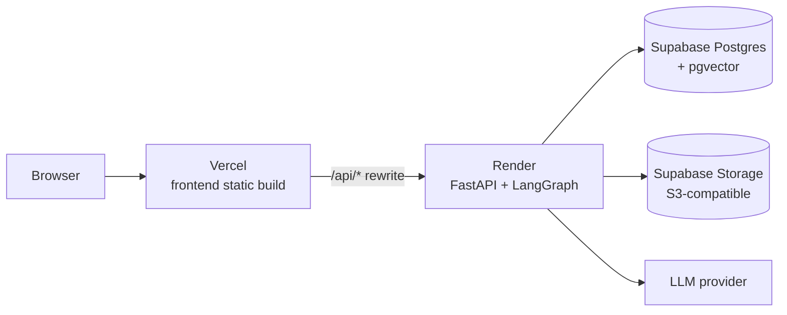

# Deployment

Target architecture: **Supabase** (managed Postgres + S3-compatible Storage) + **Render**
(the FastAPI/LangGraph backend, which needs a persistent process — Supabase and Vercel don't
run one) + **Vercel** (the static frontend build).



This split exists because none of Supabase or Vercel can host the backend as-is: Supabase is a
managed-Postgres-plus-BaaS platform with Deno edge functions, not a Python process host; Vercel
runs short-lived serverless functions, which don't fit a LangGraph agent run that streams
progress over a live connection and needs a durable checkpointer. The backend needs somewhere
that runs a persistent container — Render is the one this guide uses, but Fly.io or Railway work
the same way (both are Docker-native).

**This guide is written to be followed step by step; none of it has been executed against a
live account from this environment** — it needs real Supabase/Render/Vercel accounts, which only
you have. Treat every command below as something to run yourself (or paste back for help with),
not something already done.

## 1. Supabase — database

1. Create a project at [supabase.com](https://supabase.com).
2. SQL Editor → run `create extension if not exists vector;` (pgvector — required by
   `knowledge_chunks`'s embedding column).
3. Project Settings → Database → Connection string → **URI**. Copy it twice into `.env`,
   swapping the driver prefix as shown in `.env.example`'s Supabase block:
   - `DATABASE_URL=postgresql+asyncpg://postgres:<password>@<host>:5432/postgres`
   - `DATABASE_URL_SYNC=postgresql+psycopg://postgres:<password>@<host>:5432/postgres`
4. Run migrations against it once, from a machine with the backend's venv active:
   ```bash
   cd backend
   alembic upgrade head
   ```
5. Create your first firm/admin the same way as local dev:
   ```bash
   python -m scripts.create_firm --name "Your Firm" --email admin@yourfirm.test --password <strong password>
   ```

## 2. Supabase — storage

1. Storage → **New bucket** → name it to match `S3_BUCKET` (`casewright-documents` by default).
2. Storage → **S3 Connection** (or Settings → Storage, wording varies by Supabase version) →
   generate a new **S3-compatible access key**. Copy the endpoint, access key id, secret, and
   region into `.env`'s Supabase Storage block (see `.env.example`).
3. `app/services/storage.py` already sets `addressing_style: "path"` on the boto3 client — the
   one thing most S3-compatible providers besides AWS itself require and MinIO happened not to
   need explicitly. No other code change needed; the storage layer was already fully
   env-driven, never MinIO-specific.

## 3. Render — backend

1. New → Web Service → connect the GitHub repo, root directory `backend/`.
2. Runtime: **Docker** (it'll pick up `backend/Dockerfile` as-is).
3. Environment variables: copy every key from your `.env` (the Supabase-pointed one from steps
   1–2, plus `JWT_SECRET` — generate a real random value, don't ship the dev default — and your
   LLM provider keys). **Do not commit `.env`** — paste these directly into Render's dashboard.
4. `CORS_ORIGINS` — set to your eventual Vercel domain (e.g.
   `https://your-app.vercel.app`) once you know it. Not strictly required if you use the
   Vercel rewrite in step 4 below (same-origin from the browser's perspective, so CORS never
   triggers) — but harmless to set correctly either way.
5. Health check path: `/api/health`.
6. Deploy. Note the resulting `https://<service>.onrender.com` URL — you need it next.

## 4. Vercel — frontend

1. `frontend/vercel.json` is already in the repo with a `/api/*` rewrite to the backend and an
   SPA catch-all (so client-side routes like `/cases/:id` don't 404 on a hard refresh). **Edit
   the placeholder URL** in that file to your real Render URL from step 3, then commit.
2. Import the repo into Vercel, root directory `frontend/`. Framework preset: Vite (auto-
   detected). Build command / output directory are already set in `vercel.json`.
3. Deploy. `apiFetch` (`frontend/src/lib/api.ts`) calls a relative `/api/...` path — with the
   rewrite in place, the browser sees one origin and never has to deal with CORS at all.

## 5. First login

Same as local dev — log in with the firm/admin created in step 1.4, using the deployed frontend
URL. `docker compose` and MinIO are no longer part of the runtime picture; they're still what
`README.md`'s quickstart uses for local development, since Docker Compose remains the fastest
inner loop for that.

## Rollback / local dev unaffected

None of this changes local development: `docker compose up -d --build` still spins up local
Postgres + MinIO exactly as before. The Supabase/Render/Vercel path is additive — swap `.env`
back to the Compose defaults to go back to fully local at any time.
